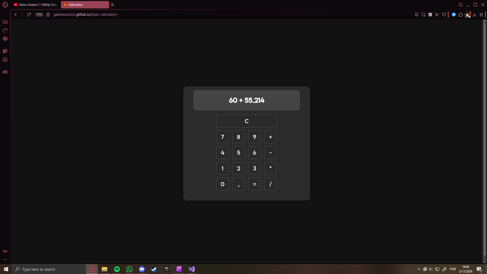

# Basic Calculator

A calculator project built with HTML, CSS and JavaScript as part of my programming learning journey.

### Features
- Basic math operations (+, -, *, /);
- Decimal number support;
- Keyboard support;
- Negative number support;
- Dark mode UI;
- CSS Grid layout;
- Custom font styling;
- Floating-point precision fixes.

### Technologies
- HTML5;
- CSS3;
- JavaScript.

### Live Demo
[Open Project](https://gabimezencio.github.io/basic-calculator/)

### Preview

### Future Improvements
- Better mobile responsiveness;
- Light/Dark mode UI switch;
- Create a custom decimal input and display system to handle floating-point precision and preserve calculator formatting;
- More advanced operations.